Iteration is a creative code learning project using P5.js, a graphics and animation library, to generate colorful art, patterns, and design. 

The project itself is not yet hosted live. The code is my work in progress. Following is a brief description of the current project, my thoughts about moving forward, as well as examples of the work I've been creating with the tool.

The project began as experimentation in Processing, a Java library, which P5.js is based on. Thanks to Coding Train/Rainbow (link to come) for the inspiring series of tutorials and projects which got me started. Originally, just a fun way to practice coding, I got hooked on generating the random, colorful designs my project was producing. When I learned of the JavaScript version of the library, I was excited for the ability to build a web tool that I could more easily control. My current work is integrating code from previous work in Processing, into the current p5.js project; building out the interface and tyeing it together with the designer.

Along with the examples of work produced by the tool, I've added brief comment on some of the various functionality I've worked into my code.

The palette is produced entering a collection of rgb values. The collection can be of varying quantity. A collection of swatches will be interpolated between each of the color relationships in the collection. Colors are randomly selected from the palette, while constraining against poorly contrasting options.

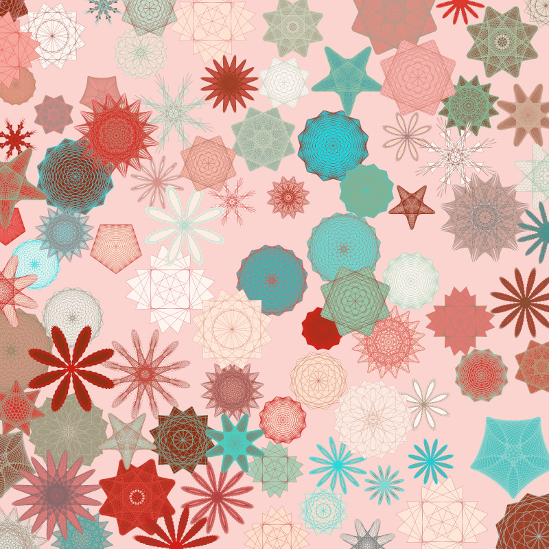

Layers can be applied, each with a different layer type. Each layer type offers unique settings and a set of associated coordinates to work with. Layer coordinates may be updated based on current settings. Layers may stack, update, and remove, then draw to the canvas in their order. Interface for layers will drag and drop and accept assignment of palettes and shapes.

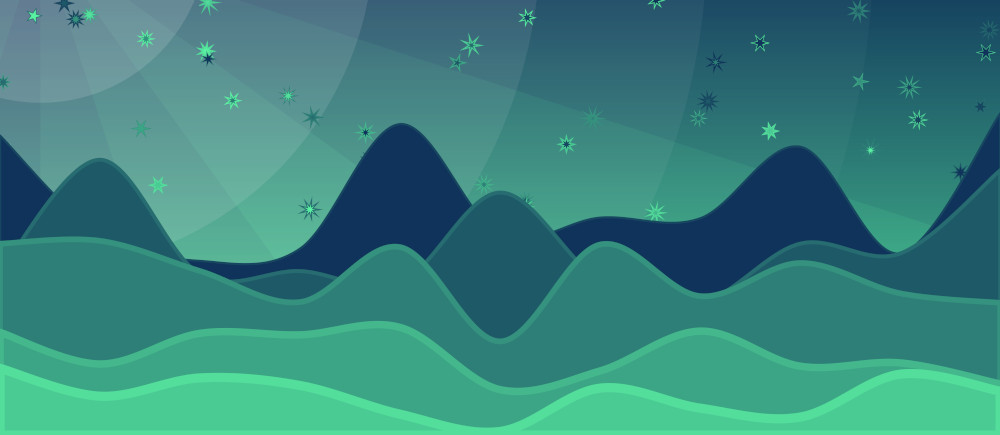 

Grid layer type assigns points to any combination of evenly divisible cells. Dynamically updates points, cells, rows, columns, lines, and diagonals. Apply shapes, fills, styles etc to create tiled patterns and striped designs.

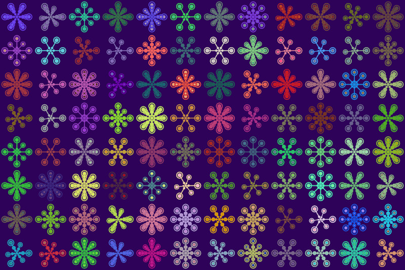

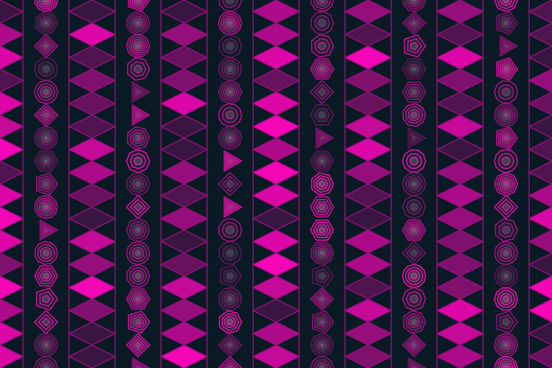

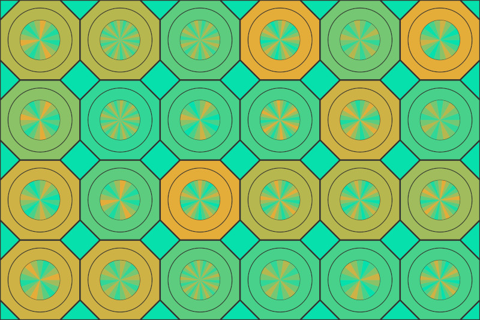

Random layer applies specified quantity of points with an adjustable spread function. Allows for tight packing of random objects, while retaining a minimum distance of overlap on objects of varying radiuses.

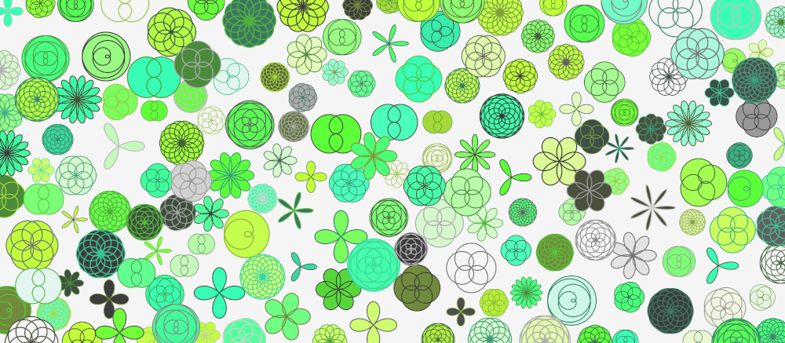

Canvas size is adjustable. The layers manage the change and stroke and design remains relative to canvas size. P5.js adds a main draw loop; animating the canvas. The tool allows for control of the frame rate, start and stop.

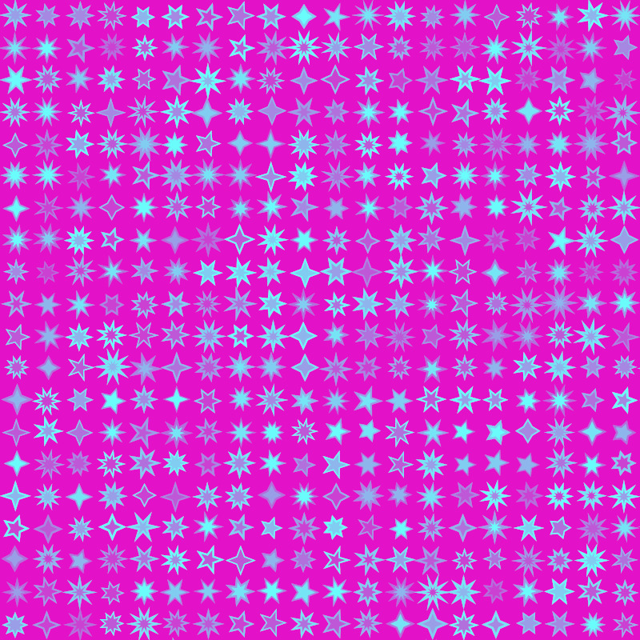

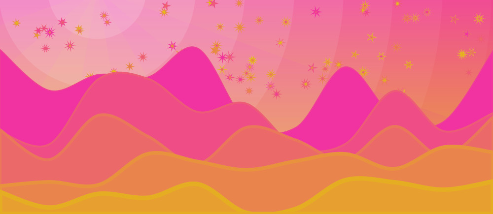

Drag and drop in the interface will allow designs and shapes which are presently only accesible directly in the code, to be easily inserted into various layer types. This includes images which can be dragged into an image palette. Designs drawn to the canvas may be downloaded directly from the browser.

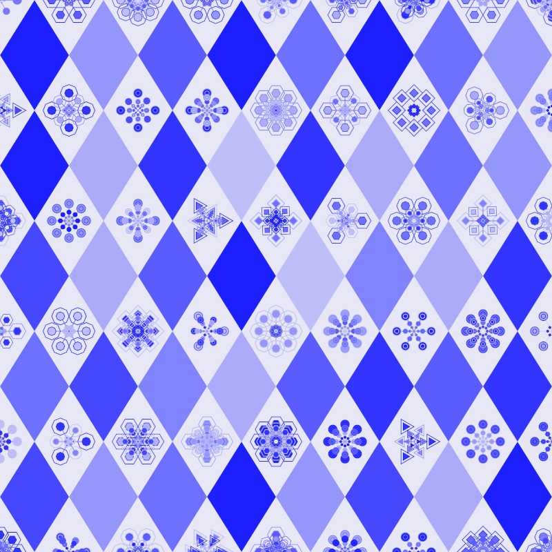

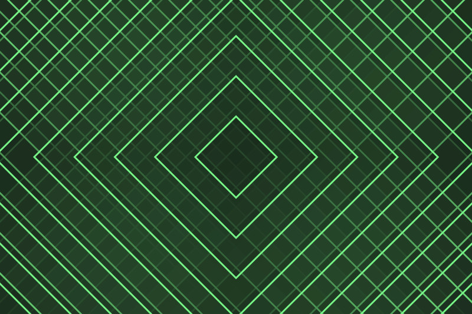

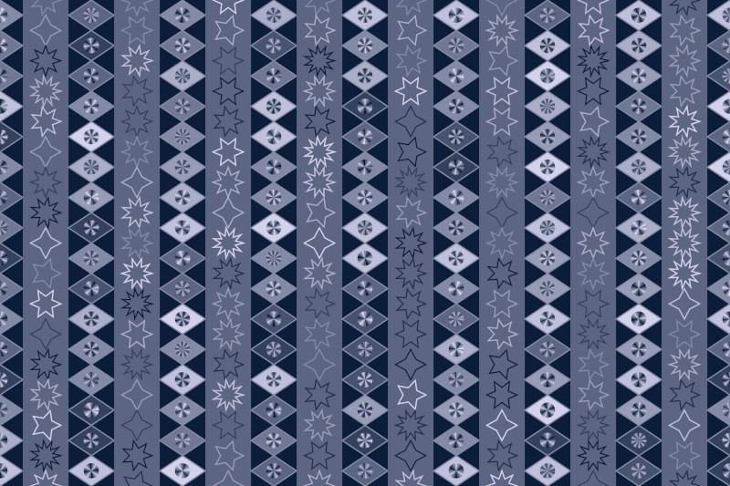

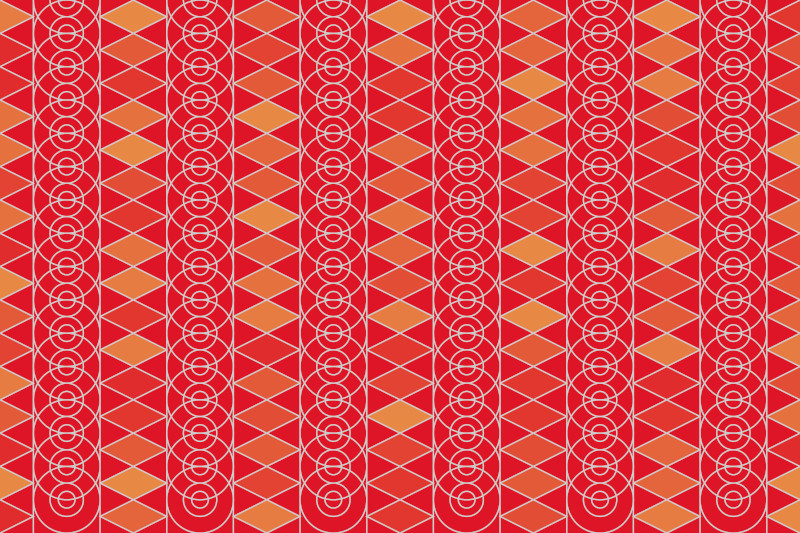

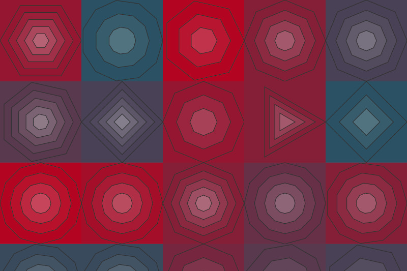

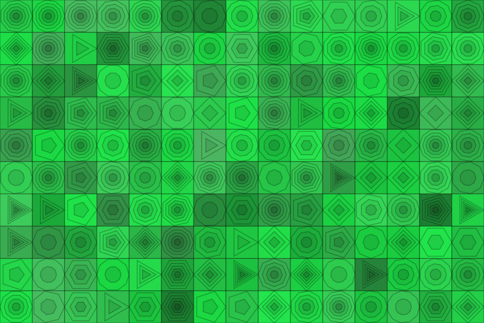

   
